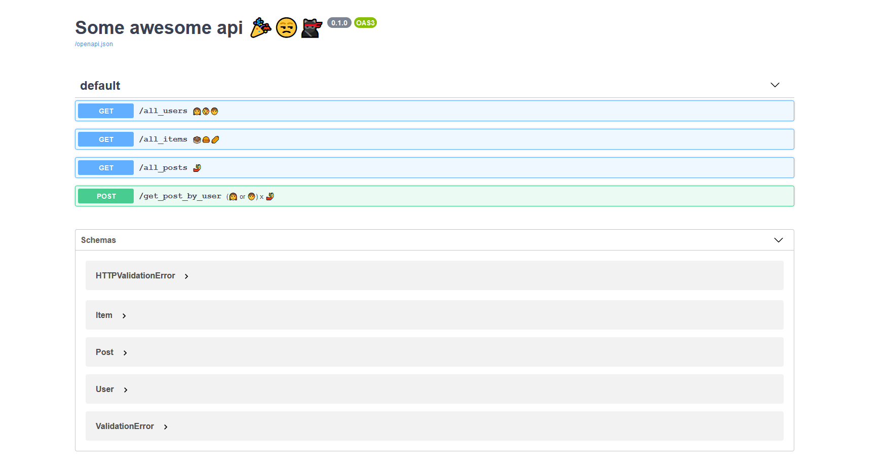

# fastAPI
> Just a dummy api

## Running

You can run this app in two ways:

#### python
1. Install [python 3.8](https://www.python.org/downloads/release/python-385/).
2. Create virtual env 
    ```shell script
    $ python3.8 -m venv venv
    $ cd venv
    $ source bin/activate 
    # Sometimes on windows `bin` is `Scripts` if above doesn't work
    # try
    $ source scripts/activate
    $ cd <repo_home>
    $ pip install -r requirements.txt
    $ export PYTHONPATH=$PWD
    $ python src/app.py
    ````

#### Docker

1. Install [Docker](https://docs.docker.com/get-docker/)
2. Build image
    ```shell script
    $ cd <repo-home>
    $ docker build --tag fast-api-server .
    ```
 3. Run image
    ```shell script
    $  docker run --name test-server -p 9090:9090 --rm  fast-api-server
    ```


If all things go well browse to [localhost:9090/docs](localhost:9090/docs) 
> 


